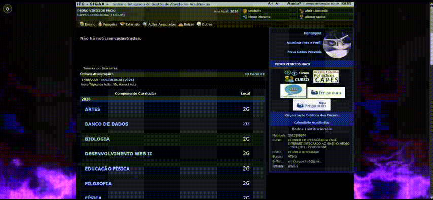
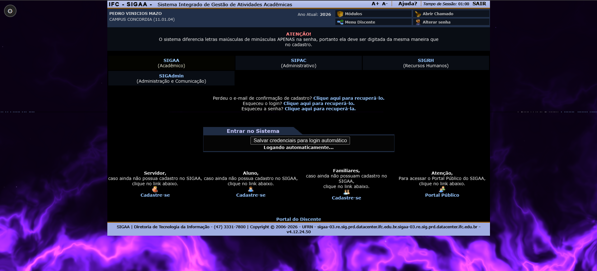

  <h1 align="center">SIGAA Utils</h1>

  <b>Extensão para navegador que deixa o SIGAA do IFC mais bonito, personalizável e agradável de usar.</b>

---

## Sobre

O SIGAA é o sistema acadêmico usado pelo IFC (Instituto Federal Catarinense). Ele cumpre bem o papel de gerenciar notas, avaliações, matrículas e boletins, mas sua aparência é pouco agradável, oferece pouca personalização e a experiência de uso deixa bastante a desejar.

O **SIGAA Utils** foi criado justamente para isso: **melhorar e personalizar a experiência de uso do SIGAA**. Com a extensão instalada, você ganha modo escuro, papel de parede personalizado, um calendário visual de avaliações, login automático e muito mais — tudo com alguns cliques, sem complicação.

## Funcionalidades

- **Modo escuro e claro** — alterne o visual da página inteira com um clique.

- **Papel de parede personalizado** — use qualquer imagem de fundo no SIGAA.

- **Fogo Roxo** — papel de parede pré-definido com efeito de fogo roxo animado.

- **Calendário de avaliações** — as avaliações da página inicial viram um calendário visual dos próximos 30 dias.

- **Destaque de notas, faltas e situação** — boletim colorido, com notas e situação em destaque.

- **Login automático** — entre no SIGAA sem digitar usuário e senha.

- **Aviso de atualização** — aviso no canto da tela quando sai uma versão nova.

- **Menus mais fluidos** — submenus do portal com transição suave.

- **Horários das aulas no SIGAA** — veja o horário da sua turma direto na página inicial.

- **Notas na página inicial** — veja as notas de cada matéria direto na home, sem abrir a Turma Virtual.

- **Dados Institucionais mais organizados** — visual mais limpo para os dados institucionais.

- **Notícias ocultas quando não há notícias** — o bloco de notícias some quando está vazio.

## Features

- `dados institucionais`: visual mais limpo e organizado na página inicial (c011f57)
- `notícias`: bloco de notícias oculto quando não há nada cadastrado
- `horários`: consulte o horário das aulas direto no SIGAA, escolhendo a turma na lista
- `horários`: opção "Nenhum" para ocultar os horários da página
- `notas na página inicial`: botão "Ver notas" em cada matéria da home, que carrega as notas sem sair da página

## Demonstração

## Login automático

Na tela de login do SIGAA aparece um botão para salvar suas credenciais. Com a opção "Login Automático" ativada nas configurações, a extensão preenche os dados e entra sozinha — sem digitar nada.

## Como instalar

1. Baixe ou clone o projeto no seu computador.
2. Abra o gerenciador de extensões do seu navegador (chrome://extensions).
3. Ative o **modo desenvolvedor**.
4. Clique em **Carregar sem compactação** e selecione a pasta do projeto.
5. Acesse o SIGAA do IFC (https://sig.ifc.edu.br) e aproveite.

## Como usar

Depois de instalada, a extensão fica disponível em todas as páginas do SIGAA. Basta clicar na **engrenagem** no canto superior esquerdo para abrir o painel de configurações e ativar ou ajustar cada recurso. Todas as preferências ficam salvas automaticamente.

## Próximas funcionalidades

- Mais papéis de parede pré-definidos (além do Fogo Roxo).
- Novos temas de cores além do modo escuro e claro.
- Suporte de visual mais limpo para outras telas do portal.

## Contribuindo

Quer ajudar a melhorar o SIGAA Utils? Toda contribuição é bem-vinda!

- Encontrou um problema? Abra uma **issue** relatando o que aconteceu.
- Tem uma ideia de funcionalidade? Compartilhe em uma **issue** antes de começar.
- Quer implementar algo? Faça um **fork**, crie uma branch, implemente e envie um **pull request**.

Seja qual for o tamanho da contribuição, ela será recebida de braços abertos. O projeto está disponível no [GitHub](https://github.com/zebedelu/SIGAAutils).

## Autor

Criado por **Pedro Vinicius Mazo**, da Turma 2G.