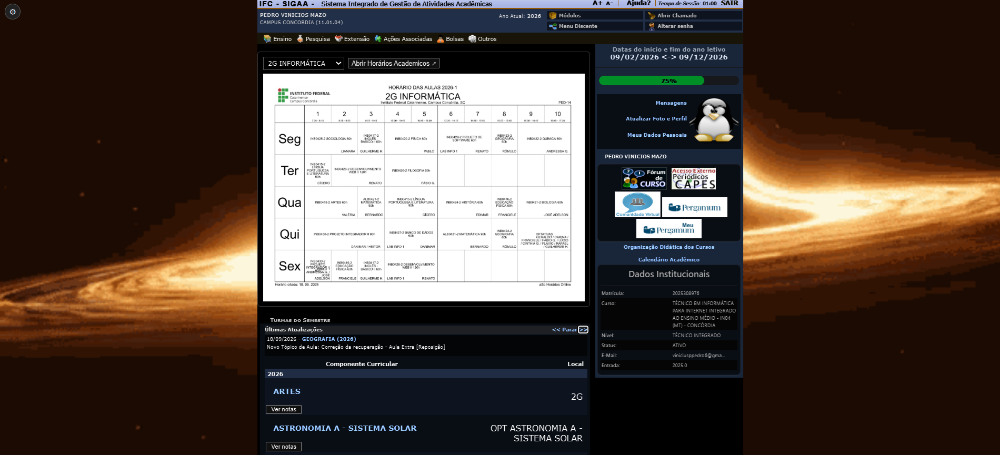
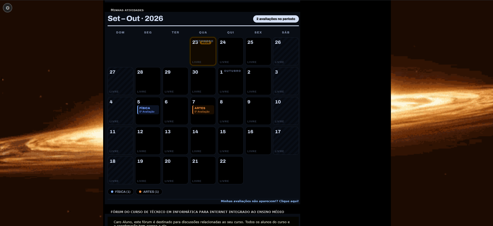
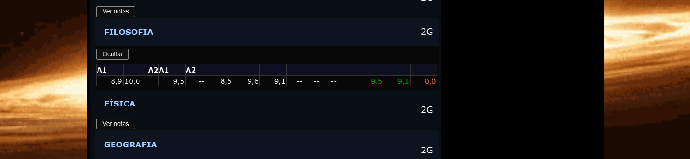

  <h1 align="center">SIGAA Utils</h1>

  <b>Viva e siga o SIGAA com a sua cara.</b>

  

  <a href="#como-instalar">Como instalar</a> ·
  <a href="#sobre">Sobre</a> ·
  <a href="#funcionalidades">Funcionalidades</a> ·
  <a href="#demonstração">Demonstração</a> ·
  <a href="#login-automático">Login automático</a> ·
  <a href="#como-usar">Como usar</a> ·
  <a href="#contribuindo">Contribuindo</a> ·
  <a href="#autor">Autor</a>

---

## Como instalar

> Leva menos de 2 minutos. Funciona no Chrome, Edge, Brave e outros navegadores baseados em Chromium.

1. **Baixe o projeto** — clique em **Code → Download ZIP** nesta página do [GitHub](https://github.com/zebedelu/SIGAAutils) e extraia o ZIP (ou clone com `git clone https://github.com/zebedelu/SIGAAutils.git`).
2. **Abra o gerenciador de extensões** — digite `chrome://extensions` na barra de endereço (no Edge use `edge://extensions`, no Brave use `brave://extensions`).
3. **Ative o Modo desenvolvedor** — ligue o interruptor no canto superior direito da página de extensões.
4. **Carregue a extensão** — clique em **Carregar sem compactação** e selecione a pasta do projeto (a que contém o `manifest.json`).
5. **Pronto** — acesse o [SIGAA do IFC](https://sig.ifc.edu.br) e aproveite.

> **Dica:** depois de baixar uma versão nova da extensão, volte ao gerenciador e clique no botão de recarregar (🔄) do cartão do SIGAA Utils para aplicar as mudanças.

## Sobre

O SIGAA é o sistema acadêmico usado pelo IFC (Instituto Federal Catarinense). Ele cumpre bem o papel de gerenciar notas, avaliações, matrículas e boletins, mas sua aparência é pouco agradável, oferece pouca personalização e a experiência de uso deixa bastante a desejar.

O **SIGAA Utils** foi criado justamente para isso: **melhorar e personalizar a experiência de uso do SIGAA**. Com a extensão instalada, você ganha modo escuro, papel de parede personalizado, um calendário visual de avaliações, login automático e muito mais — tudo com alguns cliques, sem complicação.

## Funcionalidades

- **Modo escuro e claro** — alterne o visual da página inteira com um clique.

- **Papel de parede personalizado** — use qualquer imagem de fundo no SIGAA.

- **Fogo Roxo** — papel de parede pré-definido com efeito de fogo roxo animado.

- **Calendário de avaliações** — as avaliações da página inicial viram um calendário visual dos próximos 30 dias.

- **Destaque de notas, faltas e situação** — boletim colorido, com notas e situação em destaque.

- **Login automático** — entre no SIGAA sem digitar usuário e senha.

- **Aviso de atualização** — aviso no canto da tela quando sai uma versão nova.

- **Menus mais fluidos** — submenus do portal com transição suave.

- **Horários das aulas no SIGAA** — veja o horário da sua turma direto na página inicial, com opção "Nenhum" para ocultar quando não quiser.

- **Notas na página inicial** — botão "Ver notas" em cada matéria da home, que carrega as notas sem sair da página; com botão "Ocultar" para recolher.

- **Progresso do ano letivo** — barra com a porcentagem do ano letivo já decorrida, direto na página inicial.

- **Dados Institucionais mais organizados** — visual mais limpo para os dados institucionais.

- **Notícias ocultas quando não há notícias** — o bloco de notícias some quando está vazio.

## Demonstração

**Página inicial completa** — modo escuro, papel de parede, horários da turma, progresso do ano letivo e botões de nota:

**Calendário de avaliações** — as próximas avaliações viram um calendário visual:

**Notas na página inicial** — as notas de cada matéria aparecem direto na home, sem abrir a Turma Virtual:

## Login automático

Na tela de login do SIGAA aparece um botão para salvar suas credenciais. Com a opção "Login Automático" ativada nas configurações, a extensão preenche os dados e entra sozinha — sem digitar nada.

## Como usar

Depois de instalada, a extensão fica disponível em todas as páginas do SIGAA. Basta clicar na **engrenagem** no canto superior esquerdo para abrir o painel de configurações e ativar ou ajustar cada recurso. Todas as preferências ficam salvas automaticamente.

## Contribuindo

O SIGAA Utils nasceu no IFC, feito por um estudante para os colegas — e ele fica ainda melhor com a comunidade. Se você usa a extensão e quer deixar o SIGAA ainda mais seu, é só se juntar:

- **Achou um bug?** Abra uma [issue](https://github.com/zebedelu/SIGAAutils/issues) contando o que aconteceu (e, se puder, como reproduzir).
- **Tem uma ideia?** Abra uma issue antes de codar — assim a gente alinha o caminho e ninguém faz o trabalho duas vezes.
- **Quer implementar?** Dá um **fork**, crie uma branch, implemente e mande um **pull request**.

Issue pequena, PR enorme, sugestão no chat — tudo é bem-vindo. O código está no [GitHub](https://github.com/zebedelu/SIGAAutils).

## Autor

Criado por **Pedro Vinicius Mazo**, da Turma 2G.
